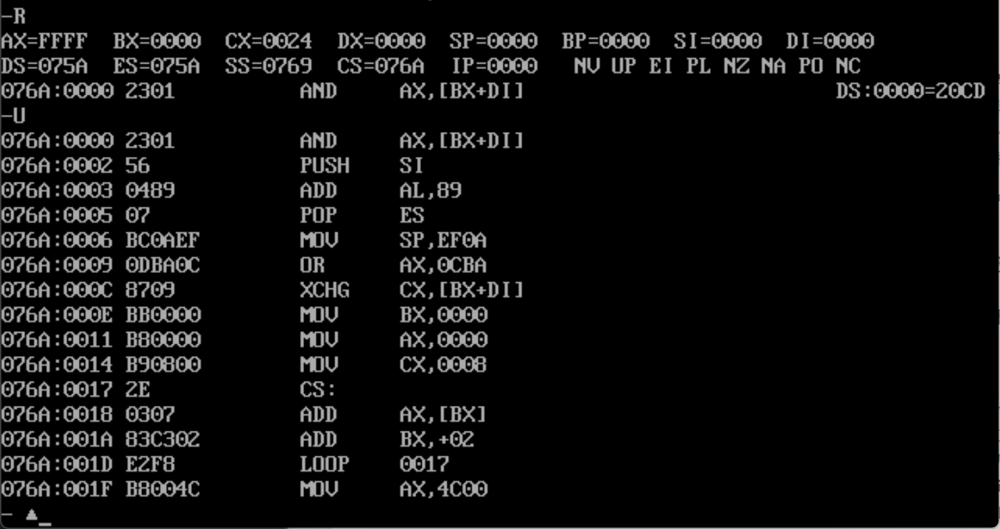

### 0x01 在代码段中使用数据

程序取得所需空间的方法有两种，一种是程序在执行的过程中向系统申请，这个前面已经体验过了，下面我们来讨论一下第二种：在加载程序的时候为程序分配。

我们可以在程序中，定义我们希望处理的数据，这些数据会被编译、连接程序作为程序的一部分写到可执行文件中。当程序被载入内存时，这些数据也会同时载入内存中。该如何定义呢？来看如下实例：

```assembly
assume cs:code
code segment
	@ 将以下 8 个数据的和，存入 ax 寄存器中：
	dw 0123h,0456h,0789h,0abch,0defh,0cbah,0987h
	
	mov bx,0
	mov ax,0
	mov cx,8
	
s:  add ax,cs:[bx]
	add bx,2
	loop s
	
	mov ax,4c00h
	int 21h
	
code ends
end
```

解释一下，程序第一行中的 "dw" 的含义是定义字型数据，即 "define word"。在这里，使用 dw 定义了 8 个字型数据，它们所占的空间为 16 个字节。其他指令就不一一解释了，然后我们将其编译，连接，最后放入 Debug 程序查看一下：



可以看到，程序的前面出现了一些让人读不懂的指令，是因为程序前面有一段 16 字节的数据，即我们用 "dw" 定义的数据，它们被转化成了指令。然而我们并不需要执行它们，可以将 IP 设置为 10h，让 CS:IP 指向程序中的第一条指令，但是这是在调试模式下，在系统中直接运行可能会出现问题，因为程序入口处并不是我们希望执行的指令，所以我们需要在源程序中指定程序的入口：

```assembly
assume cs:code
code segment
	dw 0123h,0456h,0789h,0abch,0defh,0fedh,0cbah,0987h

@ 将 Tag start 置于此处，声明程序入口为 mov bx,0
start:	mov bx,0
		mov ax,0
		mov cx,8
	
s:  	add ax,cs:[bx]
		add bx,2
		loop s
	
		mov ax,4c00h
		int 21h
	
code ends
@ 指定 Tag start 处为程序的入口
end start
```

在这里，我们再次探讨一下 end 的作用：end 除了通知编译器程序结束之外，可以可以通知编译器程序的入口在什么地方，在上例中，我们使用 end 指令声明了程序入口在 start 处，也就是说 mov bx,0 是程序的第一条命令。

---


### 0x02 在代码段中使用栈

我们也可以在程序开头定义字型数据，将其空间当做栈来使用，如下实例，利用栈将程序中定义的数据逆序存放：

```assembly
assume cs:code

code segment
	dw 0123h,0456h,0789h,0abch,0defh,0fedh,0cbah,0987h
	dw 0,0,0,0,0,0,0,0,0,0,0,0,0,0,0,0
@ 设置 ss:sp 的位置，指向我们指定的栈地址
start:	mov ax,cs
		mov ss,ax
		mov sp,30h	; 我们将 10h~2fh 指定为栈，则设置 sp=30h
@ 设置 DS 的偏移位，循环次数
		mov bx,0
		mov cx,8
@ 循环第一次，将数据 push 进栈
s1:		push cs:[bx]
		add bx,2
		loop s1
@ 重置 DS 的偏移位，循环次数
		mov bx,0
		mov cx,8
@ 循环第二次，将栈数据 pop 至指定位置
s2:		pop cs:[bx]
		add bx,2
		loop s2
		
code ends
end start
```


---


### 0x03 将数据、代码、栈放入不同段

根据前面的内容，我们可以把数据、栈和代码都放在一个段里面，但这样做还是有两个问题：

1. 把它们放在同一个段中会让程序显得混乱
2. 前面的程序中处理的数据比较少，用的栈空间也小，加上代码不长，放在同一个段里是没有问题的。但如果数据超过 64KB ，就不能放在同一个段里面了。（8086CPU 中一个段最大能容纳 64KB 的数据）

所以我们需要考虑用多个段来存放数据、代码和栈，具体做法如下面程序所示：

```assembly
assume cs:code,ds:data,ss:stack

data segment
        dw 0123h,0456h,0789h,0abch,0defh,0fedh,0cbah,0987h
data ends

stack segment
        dw 0,0,0,0,0,0,0,0,0,0,0,0,0,0,0,0
stack ends

code segment
start:  mov ax,stack	; 将 stack 的段地址存入 ax 寄存器
        mov ss,ax
        mov sp,20h

        mov ax,data		; 将 data 的段地址存入 ax 寄存器
        mov ds,ax
        
        mov bx,0
        mov cx,8

s1:     push [bx]
        add bx,2
        loop s1			; 将 data 段中的 0~15 单元的 8 个字型数据依次入栈

        mov bx,0
        mov cx,8

s2:     pop [bx]
        add bx,2
        loop s2			; 将栈中 8 个字型数据依次存入 data 段中的 0~15 单元内

        mov ax,4c00h
        int 21h
code ends

end start
```

在上面程序源码中，可以看出我们定义了数据段 `data segment`、栈段 `starck segment`、代码段 `code segment` 。在汇编程序中，可以定义很多段，它们完全是由我们自己安排的，但我们将其编译后，编译器会将这些定义的段转换为段地址，我们使用 starck 等字符命名，只是为了方便阅读，如同 start、s1、s2 等 Tag 一样，仅在源程序中存在，CPU 并不知道它们，所以在代码块中，我们使用 `mov ax,starck` 其实是将 starck 的段地址存入 AX 寄存器。

